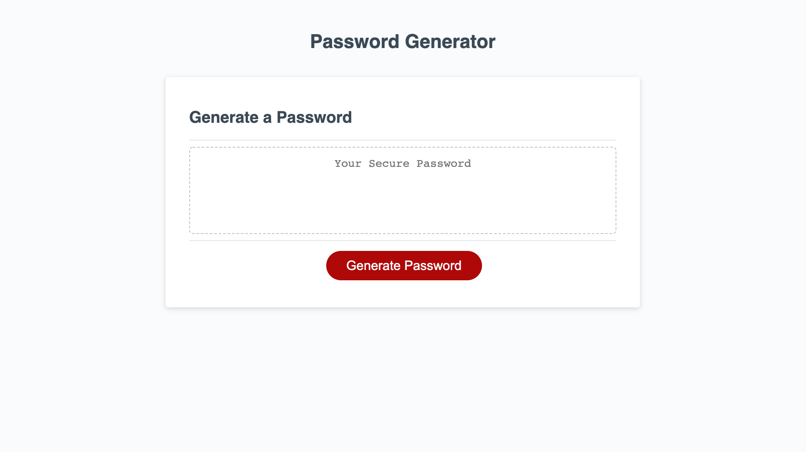

# Password Generator  README

## Description
This project required the creation of an application that an employee can use to generate a random password based on criteria they’ve selected. This app will run in the browser, and will feature dynamically updated HTML and CSS powered by JavaScript code.

## Installation
To deploy the website please upload the folder to a internet server to allow user accessiblity.

## Usage
This site will used by clients to create secure passwords.

## Portfolio Notes
This App will be consently updated when needed based on any new password  standards

## Files & directories
Directories 
* assets
* css
* images
* js

## Deployed Project
Repo
* [Password Generator](https://github.com/drkevinfriday/PasswordGen)

## Full Page

## License
Mit

## Contributing
Kevin Friday

## Credits
Made by Kevin J Friday